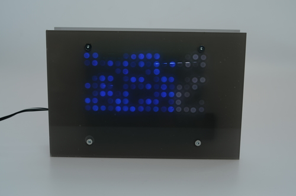

###Wave

Display of white and blue moving dots reminding of punched tape

Made with two of my Prototype-Boards, one with a 16x8 LED matrix and a TLC5920 controller and one with 16F84MCU

###Tools

Microchip MPLAB

CCS-PICC C-Compiler

PCBs made with CadSoft Eagle

###License

[BSD](LICENSE-BSD.txt) for software

[Creative Commons 4.0](LICENSE-CC.txt) for pcb and other artwork

###Copyright

Copyright (c) 2016 Bjoern Seip

